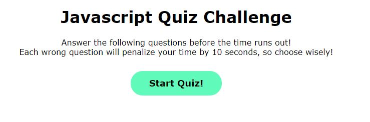

# code-quiz
## Challenge 4 Assignment

This is my first javascript application written from scratch. 

https://avamariee.github.io/code-quiz/

> This application is a Javascript Code Quiz.
>
> There are 5 multiple choice questions. An incorrect answer will display incorrect with a sound, and a correct answer will display correct with a sound.
>
> Each incorrect answer will subtract 10 seconds from the timer.
>
> The user's score is how much time is left on the timer.
>
> At the end of the quiz, the user is prompted to enter their initials so their score is saved in local storage.
>
> Once a user enters a score, however, it will override the user's previous score, and only list one score. I have been unable to figure out why at this time.
>
> I hope to return to this in the future to fix that feature.
>
> Thank you!

